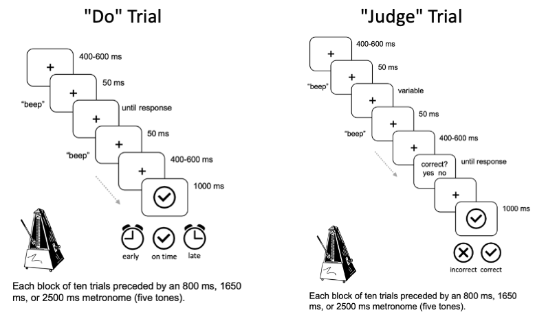

# Time Estimation

In "do" trials, participants produce a target temporal interval. In "judge" trials, participants judge a computer-produced interval as on time or not. Task is blocked, i.e. 10 "do" trials or 10 "judge" trials. Each blocks is preceded by five metronome pulses of the target interval - either short (800 ms), medium (1650 ms), or long (2500 ms).

